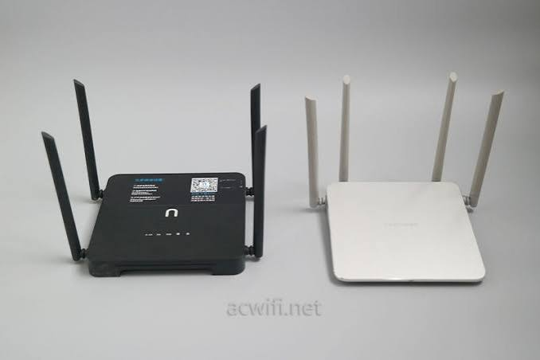

# PicoClaw Mod — 为 OpenWrt 深度定制的 PicoClaw

> 兼容 SillyTavern 角色卡 · Galgame 文字冒险 · QQ/TG 多通道 · TTS 语音 · Token 缓存优化  
> 基于 [picoclaw](https://github.com/sipeed/picoclaw) + OpenWrt/KWRT

---

## 截图

<p align="center">
  &nbsp;
  
</p>

<p align="center">
  &nbsp;
  
</p>

<p align="center">
  
</p>

---

## 🚀 AI 智能体一键部署

把这份仓库交给 AI 助手，一句话部署到你的 OpenWrt 路由器：

> **"帮我把这个项目部署到路由器 10.0.0.1，root 密码 xxxxx，API Key 是 sk-xxxxx"**

AI 会自动完成：上传文件 → 安装 CGI → 配置 LuCI → 启动服务 → 验证运行。

推荐工具：

| 工具 | 说明 |
|------|------|
| [CodeBuddy](https://www.codebuddy.ai/) | 国内可用，支持直接操作路由器 SSH |
| [Codex CLI](https://github.com/openai/codex) | OpenAI 出品，终端内使用 |
| [Claude Code](https://docs.anthropic.com/en/docs/claude-code) | Anthropic 出品，agent 能力强 |

只需准备好 3 个信息：

```
1. 路由器 IP + root 密码
2. DeepSeek API Key（或其他模型）
3. (可选) MimoTTS Token（语音功能需要）
```

---

## 快速开始

### 1. 配置 API Key

编辑 `scripts/picoclaw.sh`，填入模型 API 密钥和 TTS 密钥：

```sh
export PICOCLAW_MODEL_KEY="sk-在此填入你的DeepSeek_API密钥"
export MIMOTTS_TOKEN="在此填入你的MimoTTS令牌"
```

> ⚠️ **PICOCLAW_WEBUI_OVERRIDE 行不可删除**  
> 指向 `/tmp/picoclaw_webui.html`，删除会导致 Go binary 回退到内置 WebUI，失去自定义角色切换界面。

### 2. 部署文件到路由器

将所有文件复制到路由器 USB 根目录（挂载为 `/mnt/sda1/`）：

```
sda1/
├── picoclaw_new            # Go 二进制 (mipsle)
├── picoclaw_webui.html     # Galgame 聊天 WebUI (~36KB)
├── galgame_webui.html      # 同上（两个名字，内容一致）
├── cgi/                    # CGI 脚本 (7个)
│   ├── picoclaw_char
│   ├── picoclaw_chars
│   ├── picoclaw_create_char
│   ├── picoclaw_delete_char
│   ├── picoclaw_rules
│   ├── picoclaw_save_registry
│   └── picoclaw_soul
├── luci/                   # LuCI 文件
├── scripts/                # 启动脚本
│   ├── picoclaw.sh
│   ├── init.picoclaw
│   ├── gen_chat.sh
│   └── gen_cgis.sh
├── workspace/              # 工作区模板
│   ├── AGENT.md
│   ├── SOUL.md
│   └── USER.md
└── 文档/                   # 方案 + 规范
```

### 3. 安装 CGI 端点

```sh
cp /mnt/sda1/cgi/* /www/cgi-bin/
chmod 755 /www/cgi-bin/picoclaw_*
```

### 4. 安装 LuCI 面板

```sh
cp /mnt/sda1/luci/controller/admin/picoclaw.lua /usr/lib/lua/luci/controller/admin/
cp /mnt/sda1/luci/model/cbi/picoclaw/* /usr/lib/lua/luci/model/cbi/picoclaw/
luci-reload
```

### 5. 安装 init.d 服务 + 启动

```sh
cp /mnt/sda1/scripts/init.picoclaw /etc/init.d/picoclaw
chmod +x /etc/init.d/picoclaw
/etc/init.d/picoclaw enable
/etc/init.d/picoclaw start
```

### 6. 访问

| 路径 | 说明 |
|------|------|
| `http://路由器IP:18790/` | 全屏 WebUI |
| `http://路由器IP:18790/health` | Health 检查 |
| `http://路由器IP:18790/character/active` | 当前角色 |
| `http://路由器IP/cgi-bin/luci/admin/services/picoclaw/chat` | LuCI 聊天页 |

---

## ✨ 核心特性

### 多角色会话隔离

`session.dimensions` = `["chat", "character"]`。每个角色独立 session，切换角色时上下文不混淆：

```
chat=pico:xxx & character=kirino → sessionKey_A
chat=pico:xxx & character=kuroneko → sessionKey_B  (完全隔离)
chat=pico:xxx & (无角色)           → sessionKey_C  (向后兼容)
```

### 角色感知 Memory

| 模式 | Memory 路径 |
|------|------------|
| 无角色 | `memory/MEMORY.md` |
| 角色模式 | `memory/characters/{id}/MEMORY.md` |

### RULES.md — 跨角色永久规则

切换角色时 SOUL.md 被覆写，但 RULES.md 保留不变。适用场景：固定的角色扮演行为规范。

### QQ TTS 语音输出 🎙️

角色台词自动合成语音气泡发送到 QQ：

```
台词 ("加奈：你好呀") → QQSender → sendTTSAsync()
  → Mimo TTS → mp3 → MP3帧头解析时长
  → SendMedia(file_type=3) → QQ语音气泡 ✅
```

选项行 (`@选1`/`@选2`/...) 自动过滤，不会被转为语音。

### Token 缓存优化 ⚡

DeepSeek 前缀匹配上下文缓存 + 滑动窗口压缩策略：

```
修复前: [sys | t1...t6] → 50% → [t4...t6]  前缀断裂 → 全量 miss
修复后: [sys | t1...t6] → 滑窗 → [t2...t6]  前缀连续 → 命中率 ↑
```

日志输出 `cache_hit_tokens` / `cache_hit_ratio`，可见缓存效果。

### Galgame WebUI

- 单文件 Vanilla JS (~36KB)，零框架依赖
- GAL 格式渲染：`@场景` `@人物` `@说` `@心` `@旁白` `@回忆` `@选1-3`
- 选项按钮可点击，自动填充消息
- Markdown 渲染 + Token 计数器 + 流式输出
- PNG 角色导入 (SillyTavern V2/V3)，`<!-- char_id:xxx -->` 自标记
- 角色栏 pill 按钮，点击切换 + localStorage 历史隔离

---

## CGI 端点 (7个)

| 端点 | 方法 | 功能 |
|------|------|------|
| `picoclaw_char?id=xxx` | GET | 获取角色卡 |
| `picoclaw_chars` | GET | 角色列表 |
| `picoclaw_create_char?id=xxx` | POST | 创建角色（body=raw prompt） |
| `picoclaw_delete_char?id=xxx` | GET | 删除角色 |
| `picoclaw_save_registry` | POST | 保存注册表 JSON |
| `picoclaw_soul` | GET/POST | SOUL.md 读写（保留 Reply Rules） |
| `picoclaw_rules` | GET | 读取 RULES.md |

---

## 文件结构

### 路由器运行时

```
/tmp/picoclaw_bin          — Go 二进制
/tmp/picoclaw_webui.html   — WebUI
/www/cgi-bin/picoclaw_*    — CGI 端点 (7个)
/etc/init.d/picoclaw       — 服务脚本

/root/.picoclaw/
├── config.json             — 主配置
├── workspace/
│   ├── SOUL.md             — 当前角色身份
│   ├── RULES.md            — 永久规则
│   ├── IDENTITY.md         — Agent 身份
│   ├── USER.md             — 用户信息
│   ├── characters/         — 角色卡 + _registry.json
│   └── memory/             — 记忆系统
│       ├── MEMORY.md
│       ├── YYYYMM/         — 日记轮转
│       └── characters/{id}/
│           ├── MEMORY.md
│           └── YYYYMM/
```

### LuCI 面板

```
/usr/lib/lua/luci/view/admin_picoclaw/chat.htm
/usr/lib/lua/luci/view/admin_picoclaw/status.htm
/usr/lib/lua/luci/controller/admin/picoclaw.lua
/usr/lib/lua/luci/model/cbi/picoclaw/agent.lua
/usr/lib/lua/luci/model/cbi/picoclaw/picoclaw_bridge.lua
/usr/lib/lua/luci/model/cbi/picoclaw/security.lua
```

---

## 配置调优

`/root/.picoclaw/config.json` 推荐值：

```json
{
  "context_window": 65536,
  "summarize_token_percent": 50,
  "summarize_message_threshold": 50,
  "log_level": "warn"
}
```

> 需查看缓存命中效果时，将 `log_level` 临时改为 `"info"`。

---

## 技术栈

- **后端**: Go (PicoClaw gateway, port 18790)
- **前端**: Vanilla JS + CSS (零框架，单文件 ~36KB)
- **通信**: WebSocket + `token.picoclaw-router-2026` 子协议
- **LLM**: DeepSeek API (支持上下文缓存 / prefix cache)
- **TTS**: MimoTTS → MP3 语音气泡
- **角色存储**: 服务端 Markdown 文件 + JSON 注册表
- **会话隔离**: `chat + character` 双维度 session key
- **聊天历史**: 浏览器 localStorage（按角色隔离）
- **记忆系统**: 文件存储，按角色隔离 + 日记自动轮转

---

## Go 源码修改清单

| 文件 | 修改 |
|------|------|
| `pkg/agent/memory.go` | MemoryStore 角色隔离路径 |
| `pkg/agent/context.go` | ContextBuilder + 角色 ID |
| `pkg/agent/context_budget.go` | 砍半冻结保护 + 逐轮裁剪 |
| `pkg/agent/context_legacy.go` | 滑动窗口压缩（缓存友好） |
| `pkg/agent/pipeline_llm.go` | 缓存命中率监控日志 |
| `pkg/agent/instance.go` | SetCharacterID 回调链 |
| `pkg/health/server.go` | activeCharacter + 端点 |
| `pkg/channels/base.go` | characterGetter + 注入 |
| `pkg/channels/pico/pico.go` | sendTTSAsync + @选过滤 |
| `pkg/channels/qq/qq.go` | 异步 TTS 集成 |
| `pkg/channels/qq/init.go` | TTS provider 注入 |
| `pkg/channels/qq/audio_duration.go` | MP3 帧头解析 |
| `pkg/providers/protocoltypes/types.go` | UsageInfo 扩展 |
| `pkg/session/allocator.go` | character 维度 |
| `pkg/routing/route.go` | character 白名单 |

---

## ⚠️ 重要教训

| 项目 | 说明 |
|------|------|
| Pico Token | 原始字符串 `picoclaw-router-2026`，不要 base64 |
| CGI 权限 | **755**（nobody 需读权限），不能 711 |
| BusyBox | 无 python3 / jq；sed 不支持 `\b` / `\1` |
| OverlayFS | config.json 有双层路径，直接写 `/root/.picoclaw/` |
| context_window | 至少 32K；64K 推荐，小于 32K 会导致频繁压缩 |

---

## 核心竞争力与不足

与市面上成熟的 AI 角色扮演产品（如猫箱、星野、SillyTavern 等）相比：

### ✅ 优势

| 维度 | 说明 |
|------|------|
| **数据隐私** | 跑在自己路由器上，对话记录、角色卡、Memory 全部本地存储，不经过任何第三方服务器 |
| **零审查** | 无内容审核，创作自由。不存在角色被下架、内容被过滤的问题 |
| **全栈可控** | 自选模型（DeepSeek/V3/ChatGPT）、自调参数、自定 prompt，不受厂商策略变更影响 |
| **多通道融合** | 同一角色可同时通过 WebUI / QQ / Telegram 互动，聊天记录跨通道统一 |
| **硬件复用** | 路由器 24h 运行，不额外消耗手机电量或云服务器费用 |
| **开源可改** | 想加功能自己写，不依赖厂商排期 |

### ❌ 不足

| 维度 | 说明 |
|------|------|
| **门槛高** | 需要 OpenWrt 路由器 + 手工部署，无法像 App 一样即装即用 |
| **无独立 App** | WebUI 依赖浏览器，体验不如原生 App 流畅 |
| **TTS 受限** | 依赖第三方 TTS 服务（Mimo），音色和自然度无法与商业产品比 |
| **算力有限** | 路由器芯片性能弱，所有推理走远程 API，断网不可用 |
| **品控靠人** | UI 简陋、缺新手引导、错误处理不优雅——开发者体验级，不是消费产品级 |

### 🎯 适合谁

- 喜欢折腾、有 OpenWrt 设备的开发者
- 重视隐私、不想把角色数据交给大厂的用户
- 需要 QQ/Telegram 多通道角色的群聊场景
- 想二次开发、深度定制的进阶玩家

> 如果你只想"下载 → 点两下 → 开始聊"，**猫箱 / 星野** 更适合你。  
> 如果你想要"我的角色、我的数据、我的规则，跑在我自己的设备上"，来对地方了。

---

## SillyTavern 生态参考

本项目兼容 SillyTavern 角色卡格式，以下社区项目可配合使用：

| 项目 | ⭐ | 说明 |
|------|:--:|------|
| [TauriTavern](https://github.com/Darkatse/TauriTavern) | 965 | Tauri v2 原生封装 ST 前端，全平台（桌面+移动），Rust 后端免装 Node.js |
| [ForkSilly](https://github.com/fatsnk/forksilly.doc) | 125 | React Native Android 客户端，兼容 ST 角色卡/世界书/预设/正则 |
| [NativeTavern](https://github.com/miaoxworld/NativeTavern) | 82 | Flutter 跨平台（iOS+Android），98% ST 核心功能，Rust FFI |
| [SillyTavern](https://github.com/SillyTavern/SillyTavern) | — | 酒馆官方，可通过 Termux 在 Android 运行（[安装指南](https://docs.sillytavern.app/installation/android-(termux)/)） |

> PicoClaw Mod 是**服务端**角色引擎（路由器常驻），以上项目是**客户端** UI。两者可搭配使用。

---

## 已知技术限制

- macOS/Windows 完整编译被 matrix CGo/libolm 阻塞（mipsle 交叉编译正常）
- QQ 通道 WebSocket 偶发 4004 Authentication fail，需重新配 token
- exec 工具在路由器受限环境（无 python / jq）下功能有限

---

**版本**: 2026-07-21  
**运行状态**: ✅ 已验证，路由器 PID 运行正常
